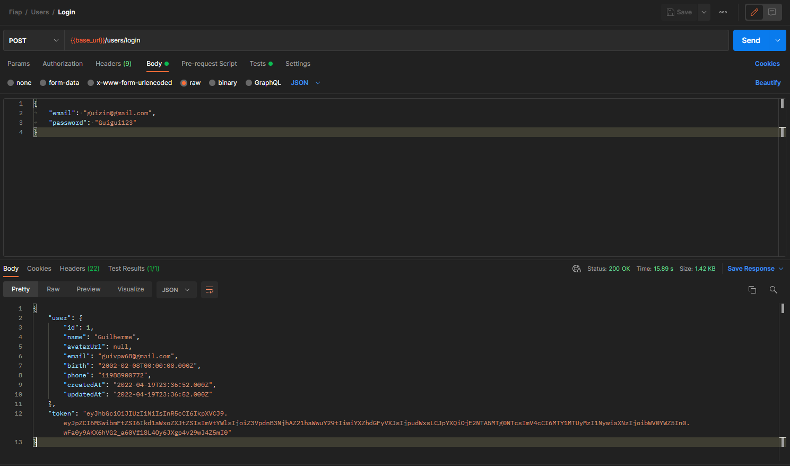
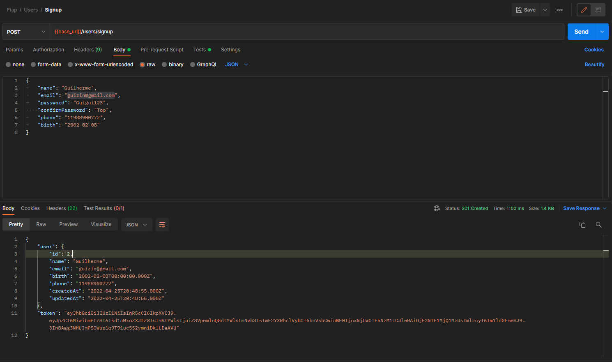
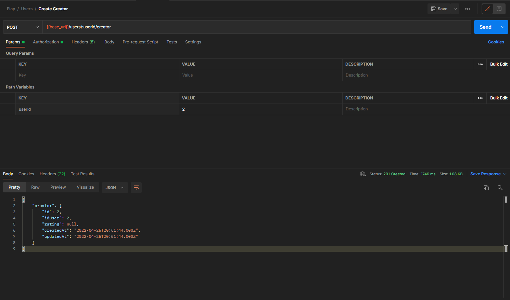
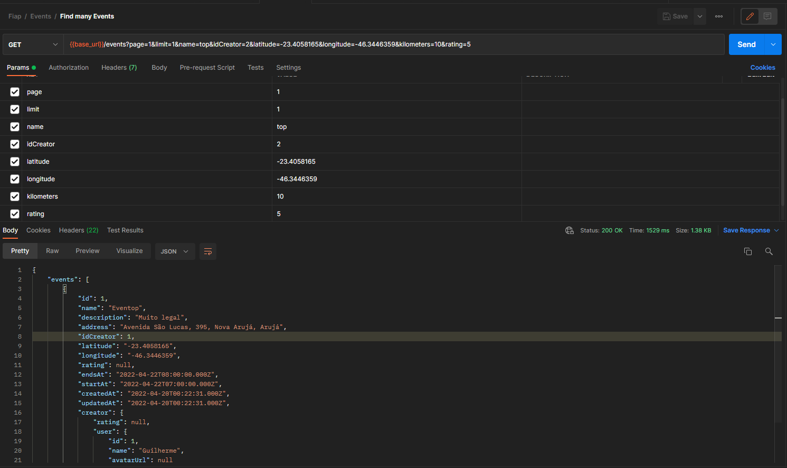
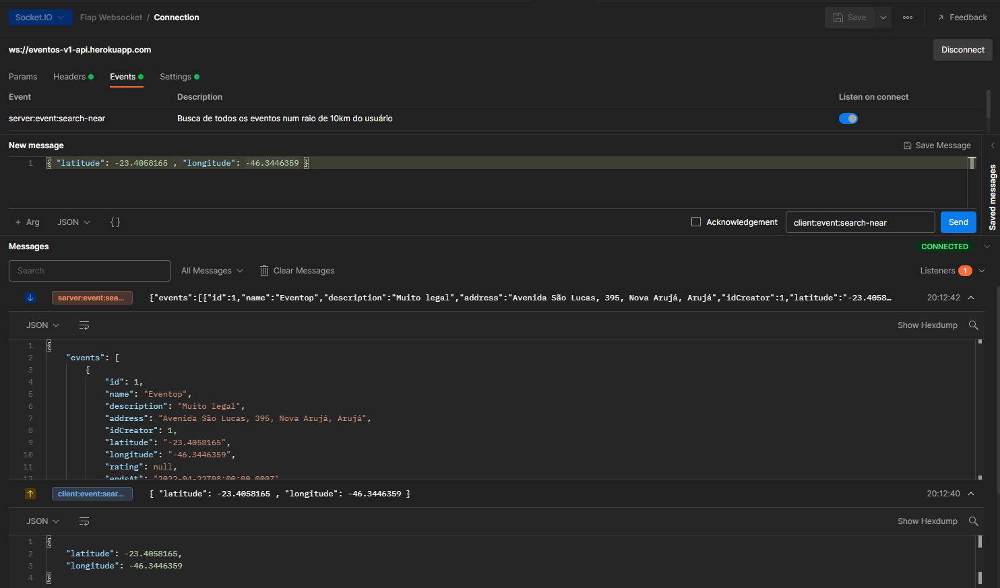

# Use cases de teste

## Rotas do usuário
### Login

### SignUp

### Tornar-se Criador

## Rotas do Criador
### Criar evento

## Rota do Evento
### Achar vários eventos com filtros

## Rota utilizando Websocket
### Achar vários eventos em um raio de 10 km

